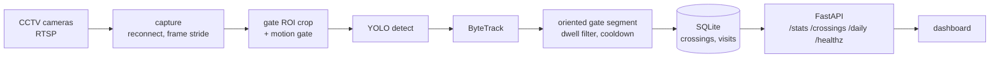

<h1 align="center">GateWatch</h1>

<p align="center">
  Real-time vehicle and footfall logging from live CCTV, built to run on a CPU-only server with no one watching it.
</p>

<p align="center">
  <a href="https://github.com/danish-puri/GateWatch/actions/workflows/tests.yml"></a>
  
  
</p>

<p align="center">
  <a href="docs/media/demo.mp4"></a>
  <br>
  <sub>The dashboard on real exit camera footage. Click for the full 27 second clip.</sub>
</p>

I built GateWatch for Gate 1 of Global College of Management in Kathmandu, Nepal. Two existing UNV CCTV cameras watch the gate. GateWatch reads their RTSP streams, detects vehicles and people, works out whether each one is entering or leaving, and writes every crossing to a database that a small HTTP API serves.

This is the second version. The first is [Bird](https://github.com/danish-puri/bird), a single script I ran in the field at two campuses and wrote a [case study](https://osf.io/6s7aw/files/9kch3) about. It had its counting line hardcoded for one camera angle, stopped for good when a stream dropped, needed a desktop window to run, and had no tests. I rebuilt it as one tested pipeline that is configured from files, keeps secrets in the environment, reconnects on its own when a camera drops, and runs under systemd or Docker.

## How it works



1. **Capture** pulls frames from each RTSP stream and reconnects with backoff when a stream stalls. It processes every Nth frame to stay light on the CPU.
2. **Perception** crops the gate region out of the 2880 px wide frame and runs YOLO there at native resolution, because the gate is a small slice of the full view. A cheap motion check runs first, so YOLO only fires when something in the gate region is actually moving.
3. **Tracking and crossing** gives every object a stable ID with ByteTrack. A crossing counts only when a track's movement step cuts an oriented segment drawn across the gate mouth. Which side of the segment faces the yard decides entry versus exit.
4. **Storage** writes each crossing to SQLite and pairs vehicle entries with their later exits into visits.
5. **The service** exposes the log over FastAPI and reports per-stream health, returning 503 when a camera goes quiet.

## Problems I had to solve

These came from running on real footage, not from the plan.

- **Parked buses were being counted.** The yard doubles as a bus depot, and a parked bus's box wobbles back and forth over the line. I added a dwell filter, so a track whose recent centroids barely spread cannot produce a count. A parked bus that pulls out to leave reads as moving again and does count.
- **One bus turning at the gate counted as an exit and an entry.** A per-track cooldown after each crossing collapses that manoeuvre into one event.
- **A long gate line counted vehicles at the far end of the yard.** I replaced it with a short segment over the gate opening and a proper segment intersection test.
- **Gate coordinates did not transfer between streams.** A sub-stream with a different crop needs its own gate. Each stream is calibrated separately, and live frames are checked against the calibrated aspect ratio so a mismatch is caught instead of silently miscounting.
- **Running YOLO on every frame of an idle yard wasted the CPU.** The motion gate skips detection until the gate region changes, and keeps going for a few frames after motion stops so a vehicle pausing mid-gate is not dropped.

## Why it does not read number plates

I expected plate reading to be the main feature, so I measured it first. On these cameras a Devanagari plate character is about 8 to 15 pixels tall, and reliable recognition needs about 30. OCR at 1x, 4x, and 8x upscaling returned noise. That is an optics problem, not a model problem, because each camera frames a scene 20 to 25 m wide.

So I turned plate reading off by default and worked out what a dedicated plate camera would need. [docs/feasibility.md](docs/feasibility.md) has the measurements, [docs/camera_placement.md](docs/camera_placement.md) has the siting guide, and [docs/resolution_budget.py](docs/resolution_budget.py) is the calculator behind both. The parser in `plate/nepali_plate.py` already validates Nepali plate formats, so the plate column fills itself once a suitable camera goes up, with no schema change.

## Privacy

The camera sees a person, not a named student. People are logged as anonymous crossings with a timestamp and a direction, and a CHECK constraint in the schema stops a plate from ever being attached to a person row. People are never paired into visits, because without a real identity source that pairing would invent arrivals that never happened.

Apart from the short dashboard clip at the top, which is a low-resolution, colour-filtered recording, this repository contains no camera footage, frames, credentials, or network addresses. Plate strings in the tests are made up.

## Running it

You need Python 3.12+ and [uv](https://docs.astral.sh/uv/).

```bash
uv sync --extra dev
cp .env.example .env                              # camera RTSP URLs and API keys
cp config/config.example.yaml config/config.yaml  # gate lines, thresholds, hours
uv run gcm-gatewatch
```

The config path can also come from `GCM_GATEWATCH_CONFIG`. If a camera URL is missing, it stops at startup and lists the variables to set, instead of failing an hour later on the first reconnect. Model weights go in `models/` and are not committed.

To replay recorded footage through the same loop, point a stream's environment variable at a video file.

| Endpoint | Returns |
|---|---|
| `GET /healthz` | per-stream health, 503 when a stream has gone quiet |
| `GET /stats` | today's counts, vehicles and people separately |
| `GET /crossings?kind=person&limit=50` | the raw entry and exit log, newest first |
| `GET /daily?day=2026-07-26` | per-day footfall and traffic |

For unattended deployment there is a systemd unit and a Dockerfile in [deploy/](deploy/).

## Tests

```bash
uv run pytest tests testing
uv run ruff check .
```

The suite runs offline, with fake capture sources and in-memory SQLite. It covers config loading and secret handling, stream reconnects, ROI and motion gating, crossing logic, calibration, the storage schema and migrations, the API, plate parsing, and the camera placement math. `testing/` holds the detection metrics (precision, recall, mAP, counting error) and the dataset tooling I use to evaluate models on labelled clips from the gate.

## Project layout

| Path | Purpose |
|---|---|
| `src/gcm_gatewatch/capture/` | RTSP ingest with reconnect |
| `src/gcm_gatewatch/perception/` | ROI, motion gate, detection, tracking, crossing, calibration |
| `src/gcm_gatewatch/storage/` | SQLite schema, migrations, repository |
| `src/gcm_gatewatch/service/` | FastAPI app and pipeline wiring |
| `src/gcm_gatewatch/plate/` | Nepali plate parser and camera placement model |
| `src/gcm_gatewatch/agents/` | interfaces for the planned agent layer |
| `webapp/` | static dashboard, no build step |
| `docs/` | architecture, feasibility study, tuning notes, camera placement |
| `deploy/` | Dockerfile and systemd unit |


More on the design is in [docs/architecture.md](docs/architecture.md).
